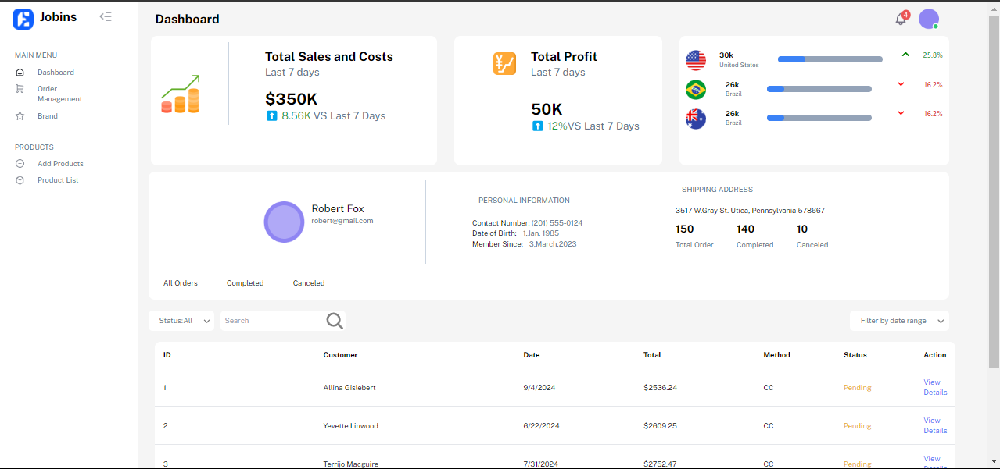
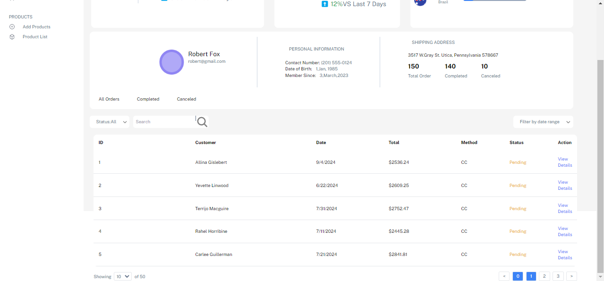

# Design-To-Code Internship Challange By Jobins
### Submitted by: Manjil Maharjan

This project is a React-based dashboard for managing product orders, tracking sales and profits, and user information. The dashboard is fully responsive and includes features like pagination, search bar via customer names. It also uses mock data generated from Mockaroo for testing and development.

## Features

- Responsive design for desktop and mobile devices.
- Pagination for displaying a large number of records.
- Search bar for filtering records by customer names.

## Future Additions
- Integration with a backend API for real-time data.
- Multiple page React router navigations.

## Screenshots

## Tech Stack
**Client:** React, TailwindCSS

## 🔗 Links

## Feedback
If you have any feedback, please reach out at:
business.manzil01@gmail.com
=======
